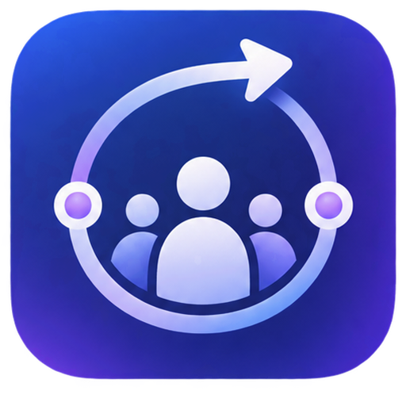

<div align="center">
  
  <h1>My Way - Family GPS Tracker</h1>
  <p><strong>Real-time family location sharing with premium features</strong></p>

  
  
  
  
</div>

---

## ✨ Features

### 🗺️ Real-Time Location Tracking
- Live family member locations on an interactive map
- Speed indicators and movement status (Stationary, Moving, Driving)
- Battery level monitoring with low-battery alerts

### 👨‍👩‍👧‍👦 Family Circle Management
- Create and join family circles
- View all family members at a glance
- Quick status updates and check-ins

### 📱 Circle Contacts
- Native text and phone actions with opt-in contact sharing per Circle
- Members choose which Circles can access their number
- Desktop fallback to copy a shared number

### 🛡️ Safety Features
- SOS emergency button
- Geofence notifications (arrive/leave alerts)
- Low battery warnings with "Send Reminder" prompts

### 📴 Offline Maps
- Download map areas for offline use
- Perfect for emergencies or low-connectivity areas
- Manage saved areas in Settings

### 🎨 Premium UI/UX
- Light and Dark themes
- Gold Member premium styling
- Glassmorphism design elements
- Responsive layout (Desktop sidebar / Mobile bottom sheet)

---

## 🚀 Quick Start

### Prerequisites
- Node.js 18+ 
- npm or yarn

### Installation

```bash
# Clone the repository
git clone https://github.com/yourusername/myway.git
cd myway

# Install dependencies
npm install

# Set up environment variables
cp .env.example .env.local
# Add your GEMINI_API_KEY to .env.local

# Start development server
npm run dev
```

The app will be available at `http://localhost:3000`

---

## 📁 Project Structure

```
HomeBase/
├── public/
│   ├── logo.png          # App logo
│   ├── icon.png          # Favicon
│   └── sw.js             # Service worker for offline maps
├── components/
│   ├── MapView.tsx       # Main map component (Leaflet)
│   ├── Header.tsx        # App header with branding
│   ├── BentoSidebar.tsx  # Desktop sidebar
│   ├── MobileBottomSheet.tsx  # Mobile navigation
│   ├── CircleContactsPanel.tsx # Native contact actions
│   ├── SettingsPanel.tsx      # User preferences
│   ├── SafetyAlerts.tsx       # Low battery alerts
│   ├── OfflineMapManager.tsx  # Offline map downloads
│   └── ...
├── services/
│   ├── offlineMapService.ts   # Tile caching logic
│   └── geminiService.ts       # AI integration
├── App.tsx               # Main application
├── types.ts              # TypeScript definitions
└── index.html            # Entry point
```

---

## ⚙️ Configuration

### Environment Variables

Create a `.env.local` file:

```env
GEMINI_API_KEY=your_gemini_api_key_here
```

### Tailwind Configuration

The app uses Tailwind CSS via CDN for rapid development. Custom styles are defined in `index.html`.

---

## 🛠️ Tech Stack

| Technology | Purpose |
|------------|---------|
| **React 19** | UI Framework |
| **TypeScript** | Type Safety |
| **Vite** | Build Tool & Dev Server |
| **Leaflet** | Interactive Maps |
| **Tailwind CSS** | Styling |
| **Google Gemini** | AI Features |

---

## 📱 Responsive Design

- **Desktop (768px+)**: Full sidebar with family list, weather, and quick actions
- **Mobile**: Bottom sheet navigation with swipe gestures

---

## 🔜 Roadmap

### Finish Before Release

- [ ] Firebase Authentication (Google Sign-In)
- [ ] Real-time family position sync
- [ ] Push notifications
- [ ] Capacitor iOS/Android builds
- [ ] Background location tracking
- [ ] Geofence automation

### After Core Release Stabilization

- [ ] **MyWay Circle membership:** Keep navigation, driver reports, and basic mileage/expense tracking free. Offer a household subscription for richer Circle coordination: longer history, more place alerts, multiple Circles, shared trip history, and family driving summaries.
- [ ] **Founding membership launch:** Offer one owner-paid annual plan with a clear trial after a user has created a Circle and invited a member.
- [ ] **Map skin store:** Optional one-time cosmetic map themes that do not affect safety or navigation access.
- [ ] **Driver Pro discovery:** Validate demand for optional high-mileage tools such as tax-ready mileage exports and shift summaries before creating a separate paid tier.

---

## 📄 License

MIT License - feel free to use this project for personal or commercial purposes.

---

<div align="center">
  <p>Built with ❤️ for families everywhere</p>
</div>
